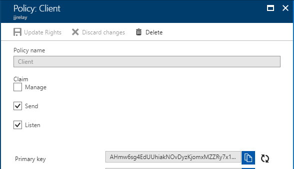
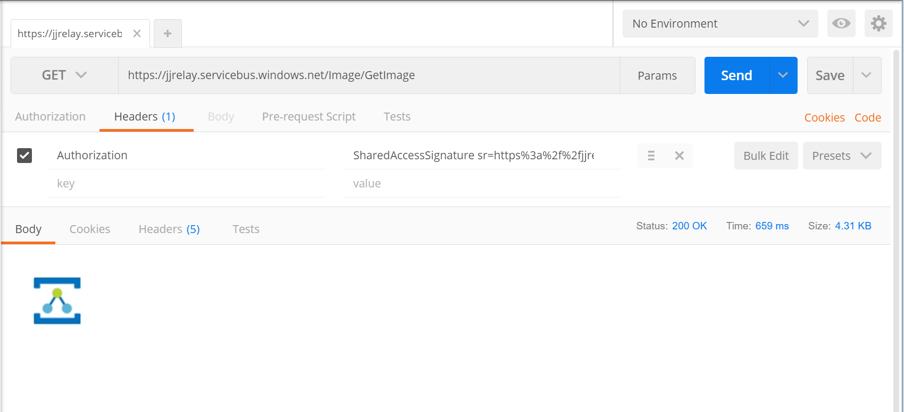

# WCF service with Service Bus Relay
WCF Service for getting image via <a href="https://docs.microsoft.com/en-us/azure/service-bus-relay/relay-what-is-it">Azure Relay</a>.<br/>
The reason is to "publish" .Net REST WCF service via Azure Relay. 
There no direct publishing of this service. Service is using WCF Relay binding to publish it. You need no firewall port publishing, communication is started from backend via HTTPS.
Client is calling Azure Relay service.<br/>
Solution is created on full DotNet. DotNetCore is not supported right now, see <a href="https://github.com/dotnet/wcf/issues/1200#issuecomment-233081695">discussion</a>.

## Create Service Bus Relay
Simply create in Azure portal new service called Relay, follow this <a href="
https://docs.microsoft.com/en-us/azure/service-bus-relay/relay-create-namespace-portal">link</a>

## Change configuration
Change Key in app.config

Section system.serviceModel\behaviors\endpointBehaviors\behaviortransportClientEndpointBehavior\tokenProvider
```xml
<sharedAccessSignature keyName="RootManageSharedAccessKey" key="KEY" />
```
Section appSettings
```xml
<add key="Microsoft.ServiceBus.ConnectionString" value="Endpoint=sb://<yournamespace>.servicebus.windows.net/;SharedAccessKeyName=RootManageSharedAccessKey;SharedAccessKey=KEY" />
<add key="RelayServiceNamespace" value="<yournamespace>"/>
```

## Test service anonymous
If you want test service in browser, change Authorization to None in app.config
Section system.serviceModel\bindings\webHttpRelayBinding\binding
```xml
<security relayClientAuthenticationType="None" />
```

Run browser with your url, my example: https://jjrelay.servicebus.windows.net/Image/GetImage <br/>
You will get image.

## Test service with security token
Check app.config for using token
Section system.serviceModel\bindings\webHttpRelayBinding\binding
```xml
<security relayClientAuthenticationType="RelayAccessToken" />
```

Next fill correct Key into client configuration
```xml    
<add key="ClientKeyName" value="RootManageSharedAccessKey" />
<add key="ClientKey" value="J9Qr7OQQI6JL3cRc6jX0yduBz3El4cVcM1x/w/le9FQ=" />
```

Configuration for policy Client


When you run server, you will get token. Call this service with token.
I'm using <a href="http://www.getpostman.com">Postman</a> to testing service - put token in Authorization header.
```header
GET /Image/GetImage HTTP/1.1
Host: jjrelay.servicebus.windows.net
Authorization: SharedAccessSignature sr=https%3a%2f%2fjjrelay.servicebus.windows.net%2fImage%2f&sig=WUHK8w2a698NvCXSGQffEmqPJlBZuJxYdJXewM4a%2fC8%3d&se=1517055215&skn=RootManageSharedAccessKey
```

Example

